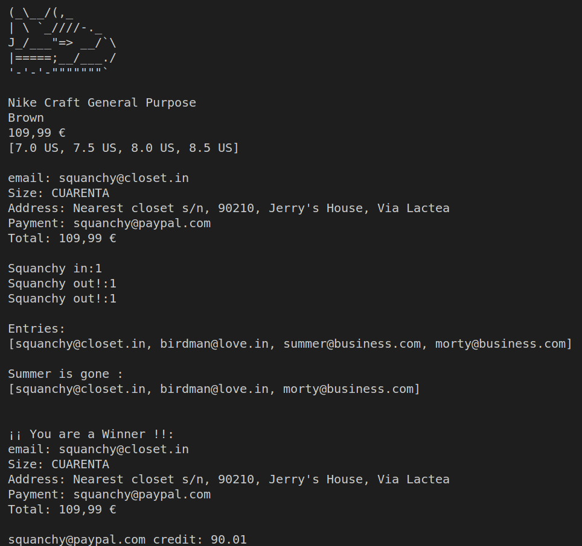

# Examen 20 02 2023 (Sneaker Raffle)

IMPORTANTE! Toda la información inicial y el enunciado del problema fue presentada por nuestro profesor (UML, historias de usuario...)

Este es el repositorio de mi solución (post examen) del mismo que nos ha presentado nuestro profesor: enunciado principal [dfleta](https://github.com/dfleta/sneaker-raffle)

El mismo día del examen no conseguí acabarlo, y además, entregué un examen del cual no estaba orgulloso. Posterior a la entrega, nos dió luz verde 
para corregir nuestro examen y aquí la solución.

Antes de comenzar a corregir mi propio examen, decidí hacer un documento con el cual indicar todo lo que en un primer momento tras el examen, no me sentía orgulloso por no haber podido demostrar mis conocimientos, sino que me dejé llevar por los nervios y la tension del momento y acabó jugando en mi contra. Para leer dichos comentarios click aquí: [review post examen](./doc/ErroresPostExamen.md)

## Funcionamiento

La aplicación consta de un sorteo/rifa de unas zapatillas de coleccionista, a la cual unos usuarios se presentan y optan a ganar dichas zapatillas.

Posteriormente, cuando se elige al ganador, se hace el cobro a su cuenta de paypal automaticamente.

Para comprobar el "correcto" fucionamiento, se hace una simulación por consola en la cual se comprueban que todos los pasos se ejecutan correctamente.

## UML

## Salida por consola

